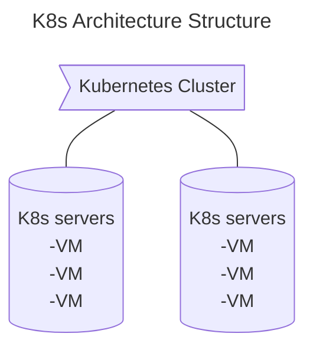
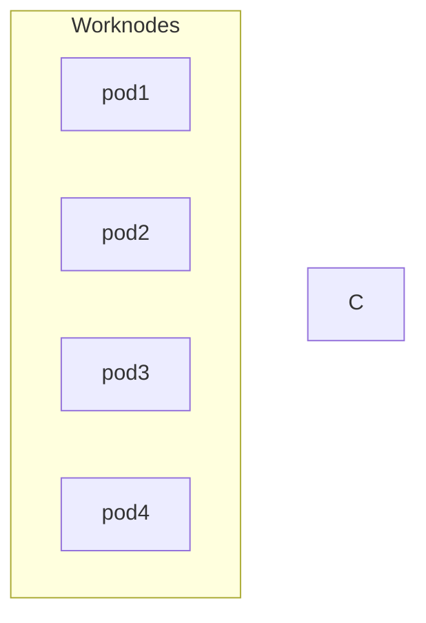

# mermaid k8s practice

```mermaid
---
title: K8s Architecture Structure
---
    flowchart TB
        doc>"Kubernetes Cluster"]---subgraphB[("K8s servers
        -VM
        -VM
        -VM")]
        doc --- C[("K8s servers
        -VM
        -VM
        -VM")]

```

```mermaid
    flowchart TB
    subgraph Worknodes
        pod1
        pod2
        pod3
        pod4
    end
    C
```

